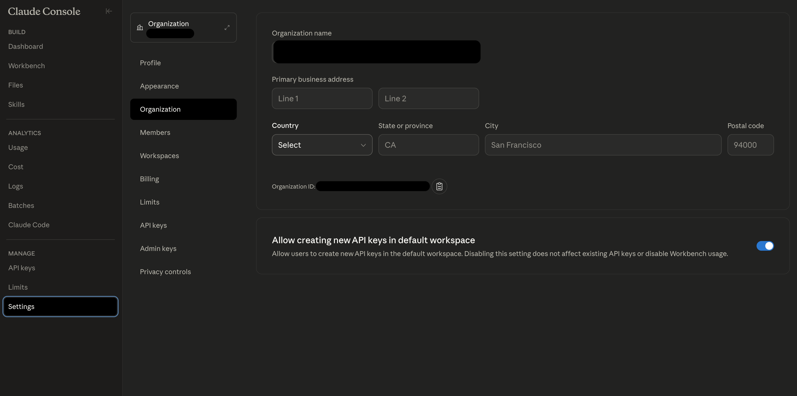
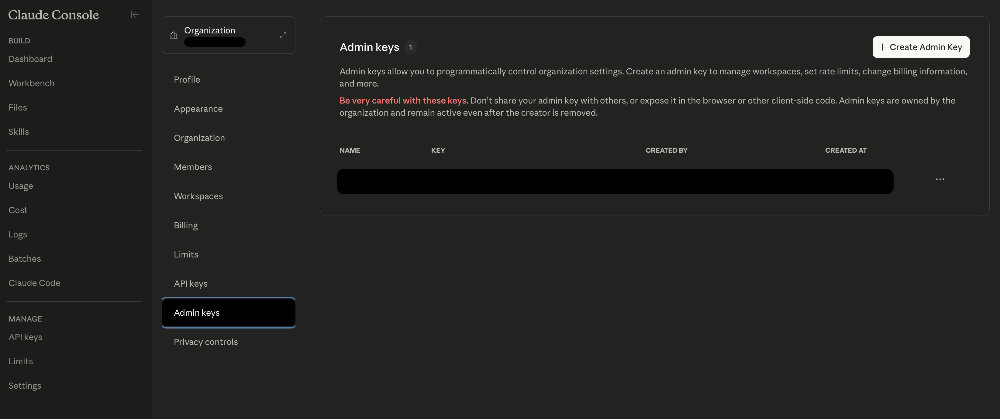

# __Description__

Connector for user, workspace and Claude Code analytics data from Anthropic's Admin API

# __Overview__

The Anthropic connector integrates with Anthropic's Admin API to collect user data, workspace information, and Claude Code analytics from the Anthropic platform. This connector provides visibility into user activity, organizational structure, and developer productivity metrics within your Anthropic ecosystem.

# __Documentation__

  ## __Setup__

  To obtain an API key for the Anthropic connector:

  1. **Access Console Settings**: Log into your Anthropic Console and navigate to the Settings section

     

  2. **Create New API Key**: In the API Keys section, click "Create Key" to generate a new API key

     

  3. **Copy the Key**: Once generated, copy and save the API key immediately as it will not be shown again
