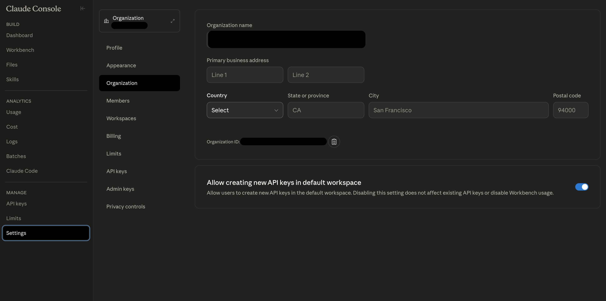
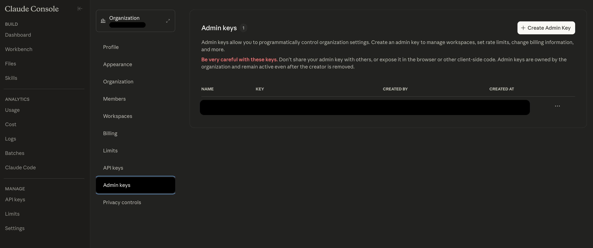

# __Description__

  Connector for user, workspace, Claude Code analytics, and organization directory data from Anthropic

# __Overview__

  Anthropic is the provider of the Claude family of models, offered through the Claude Console, the Claude API, and Claude Enterprise. This connector imports users, workspaces, and Claude Code analytics from the Admin API, and organizations, organization users, roles, and groups from the Compliance API.

# __Documentation__

  ## __Setup__

  Prerequisites before generating credentials:

  1. **Organization Account Required**: Anthropic's Admin API is unavailable for individual accounts. Ensure your account is set up as an organization in Console → Settings → Organization.
  2. **Admin Role Required for Key Provisioning**: Only organization members with the admin role can provision Admin API keys in Anthropic Console.
  3. **Admin API Key Type Required**: This connector uses Admin API endpoints and requires an Admin API key (`sk-ant-admin...`), not a standard API key.

  To obtain an Admin API key for the Anthropic connector:

  1. **Access Console Settings**: Log into your Anthropic Console and navigate to the Settings section

    

  2. **Create New Admin API Key**: In the Admin API keys section, click "Create Key" to generate a new Admin API key (`sk-ant-admin...`)

    

  3. **Copy the Key**: Once generated, copy and save the Admin API key immediately as it will not be shown again

  ## __Compliance Access Key__

  The `Compliance Access Key` is optional. It is used only by the `Anthropic Organizations, Users, Roles, and Groups` import, which collects organizations, organization users, roles, and groups. The remaining imports need only the `API Key` described above.

  This key is a different credential from the Admin API key. The Compliance API rejects Admin API keys, so a Compliance Access Key (`sk-ant-api01-...`) must be created separately.

  Prerequisites before generating the key:

  1. **Claude Enterprise Plan Required**: The Compliance API is available to Claude Enterprise organizations only.
  2. **Compliance API Entitlement Required**: The Compliance API must be enabled for your organization. If the Compliance API section is not present in your organization settings, contact your Anthropic representative.
  3. **Primary Owner or Organization Owner Role Required**: Only primary owners and organization owners can create Compliance Access Keys. A primary owner's key covers every organization under the parent organization, while an organization owner's key covers their own organization only.

  To create the Compliance Access Key:

  1. Log in to [claude.ai](https://claude.ai) as a primary owner.
  2. Select your profile in the lower-left corner, then click `Organization Settings`.
  3. In the left sidebar, click `Data and privacy`.
  4. Scroll to the `Compliance API` section and confirm that Compliance API access is enabled.
  5. Click `Create key` and give the key a name.
  6. When prompted to select scopes, select both of the following. The import fails without them:
     * `read:compliance_org_data` — organizations, roles, groups, and effective organization settings
     * `read:compliance_user_data` — organization users and group members
  7. Copy the key and store it securely. It is displayed only once.

  For more detail, refer to the Anthropic [Compliance API documentation](https://platform.claude.com/docs/en/manage-claude/compliance-api).

  ### __Effective organization settings__

  Imported organizations include the effective settings in force for each organization, such as content redaction, the IP allowlist, the SSO provisioning mode, and the chat retention period.

  This endpoint is enabled per parent organization separately from the rest of the Compliance API. When it is not enabled, organizations are still imported, without their settings. To enable it, contact your Anthropic representative.
