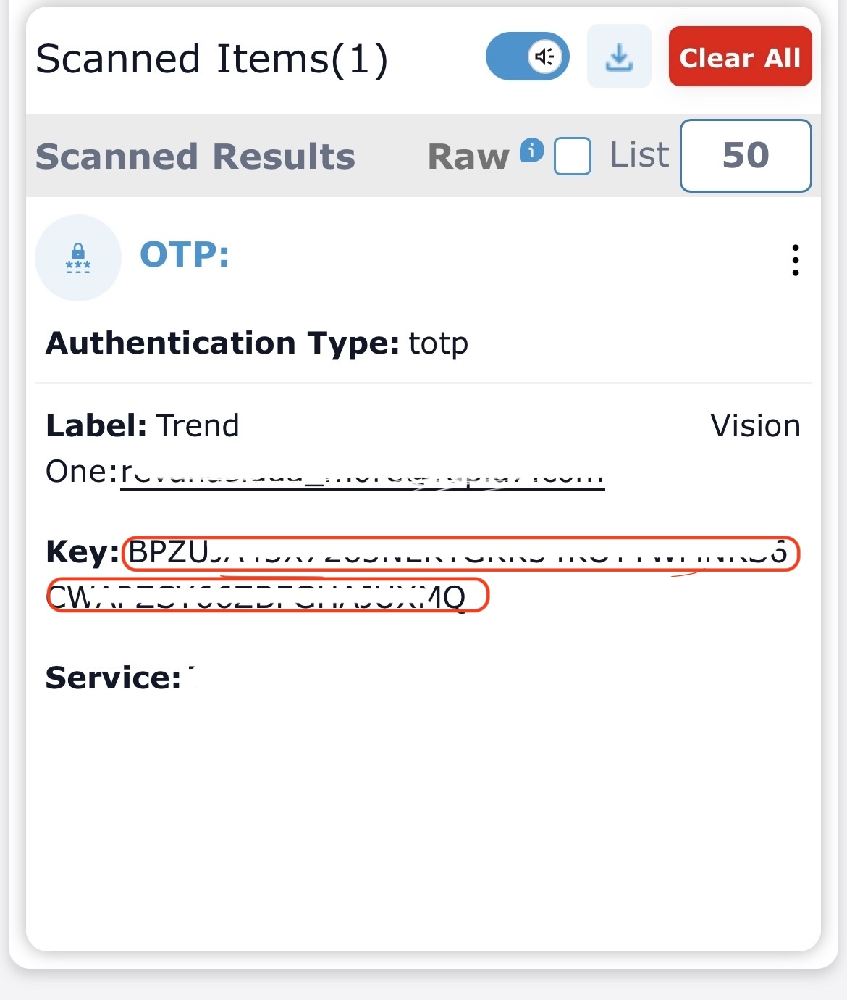

# __Description__

  Connector for Avigilon Alta (formerly Openpath).

# __Overview__

  The Avigilon Alta (formerly Openpath) is a cloud-based physical access control solution for unified video and access control.

  This connector integrates Users, Access Groups, Access Control Units (ACUs), Readers, and Sites with the Rapid7 Platform.

# __Documentation__

  ## __Setup__

  To configure this connector you need an Avigilon Alta administrator account with API access and the numeric organization ID (orgId) of the organization to import.

  ### Get your organization ID

  1. Sign in to the Avigilon Alta (Openpath) admin portal.
  2. Open your organization profile; the orgId is the numeric identifier shown in the URL and organization settings.

  ### Configure the connector

  Provide the following settings when installing the connector:

  | Setting | Description |
  | ------- | ----------- |
  | API URL | Base URL for the Avigilon Alta API. Defaults to `https://api.openpath.com`. |
  | Email | Email address of the Avigilon Alta administrator used to authenticate. |
  | Password | Password for the Avigilon Alta administrator account. |
  | Organization ID | Numeric Avigilon Alta organization ID (orgId) to import data for. |
  | TOTP Secret | (optional) TOTP secret for the Avigilon Alta user used to authenticate against the API. |

  ### Two-Factor Authentication (2FA)
  If your Avigilon Alta account is configured to require Two-Factor Authentication (2FA), you must provide
  a URL or Key for the authentication secret.  This URL or Key is used to generate a One-Time
  Password (OTP) when required.

  To find the URL or Key:
  - Configure Avigilon Alta to use an authenticator app for 2FA.
  - When Avigilon Alta shows the QR code, If it shows a "key".  Make a note of this secret key.
  - Provide that key as the "One-Time Password (OTP) Authentication Key or URL" setting in the connector.
  - If no key is shown, you can also scan the QR code using a general-purpose QR Reader app, and decode the value in the QR code. That value is a Key that begins `Key`, and this full URL can also be used instead of the generated key.
  - Refer below image for example of QR code and the generated key.
  

