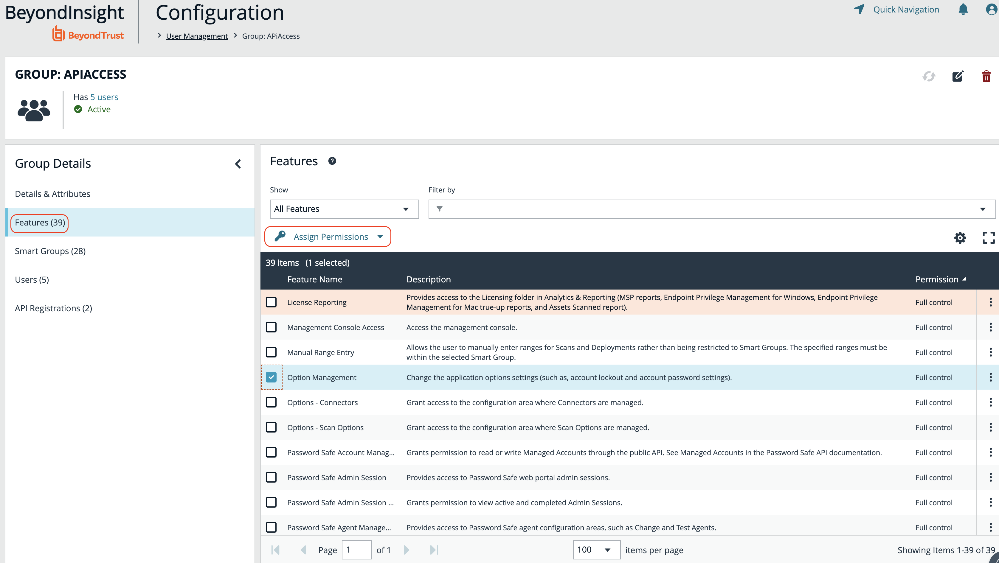
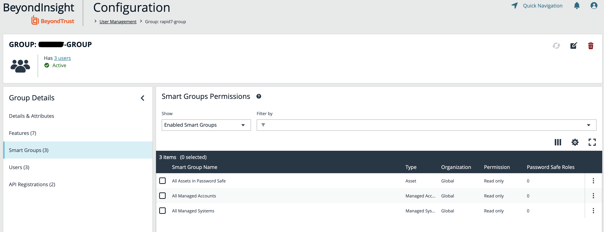
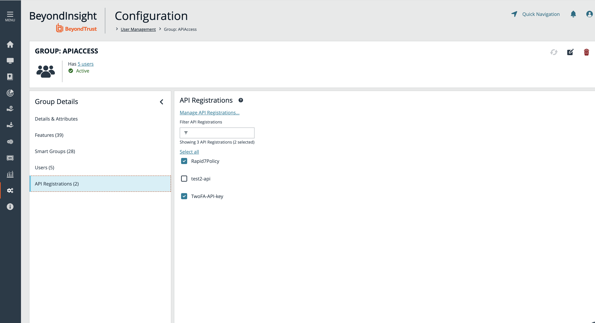
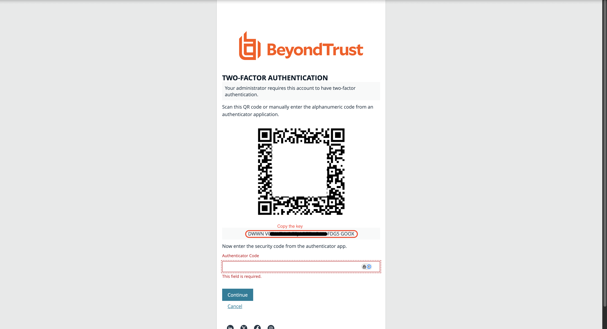

# __Description__

  Connector to integrate BeyondTrust BeyondInsight with Rapid7 Surface Command.

# __Overview__

  BeyondTrust Password Safe, an enterprise password and secrets vault, plus privileged session management solution, empowers you with complete control and accountability over privileged accounts and credentials, DevOps secrets, workforce passwords, and more.

  This connector integrates Managed Systems, Managed Accounts, Users, and User Groups from BeyondTrust BeyondInsight with the Rapid7 Platform.

# __Documentation__

  This connector requires the following information to connect to BeyondTrust BeyondInsight API:

  - **Base URL**: The URL to your BeyondTrust BeyondInsight API.
  - **Username**: A valid user account with API access.
  - **API Key**: A registered API key for authentication (see instructions below under **Obtaining the API Key**).
  - **Password**: The password for the specified user account. This is optional unless `Authentication Rule Options` was selected during API key registration.
  - **One-Time Password (OTP) Authentication Key or URL**: 2FA authentication. This is optional unless `Authentication Rule Options` was selected during API key registration (see instructions below under **Obtaining the OTP Authentication Key or URL** to get Authentication Key or URL).

  ### Obtaining the API Key:
  1. Follow the instructions in the [API Key Registration documentation](https://docs.beyondtrust.com/bips/docs/ps-cloud-configure-api-registration#add-an-api-key-policy-api-registration) to create a new API key

  2. Copy and save the generated API key securely

  > **NOTE**: When creating the API Key, an **authentication rule must be included**. Ensure that the IP ranges for your Surface Command Region are inserted, with one IP range per line. This information can be found in our [documentation](https://docs.rapid7.com/surface-command/allowlist-surface-command-ips/)

  ### To Apply Permissions to the API Key:

  1. Navigate to `Configuration > Role Based Access > User Management`.
  2. From the Group tab, click `+ Create New Group`.
  3. Under Group Details, select the `Features` & show `All Features`.
  4. Select below permissions and click on `Assign Permissions` with `Read Only`:
      * Password Safe Account Management
      * Asset Management
      * User Accounts Management

  

  5. Navigate to the group’s Smart Groups section.
  6. Select below permissions and click on `Assign Permissions` with `Read Only`:
      * All Assets in Password Safe
      * All Managed Accounts
      * All Managed Systems

  

  7. Navigate to the group’s API Registration section.
  8. Select the API key created earlier from the Available API Keys list.
   
  

  ### Obtaining the OTP Authentication Key or URL:

  1. Enable Two-Factor Authentication for your user account in BeyondTrust BeyondInsight
  2. Upon first login after enabling 2FA, you will be prompted to set up an authenticator
  3. During the setup process, a QR code and secret key will be displayed
  4. **To use the secret key**: Copy the displayed secret key directly
  5. **To use the URL**: Use a QR code scanner to read the QR code and extract the authentication URL

  
  6. Save either the authentication key or URL for using in the connector configuration

  