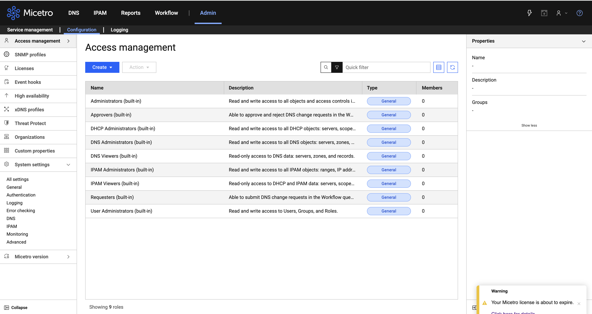
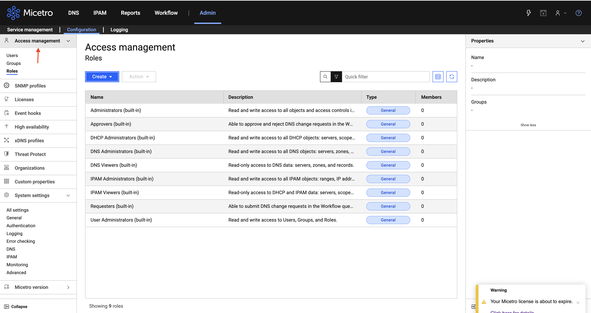
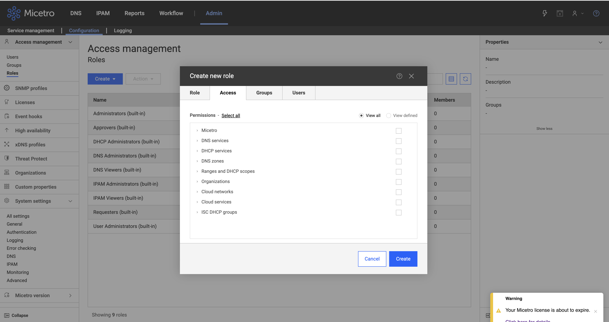

# __Description__

  Connector for Surface Command that imports IP ranges, IP address allocations, DNS zones, and DNS resource records from BlueCat Micetro DDI.

# __Overview__

  BlueCat Micetro is a multi-vendor DDI (DNS, DHCP, and IPAM) management platform that provides a unified interface for managing IP address space and DNS across heterogeneous network environments, supporting Microsoft, BIND, Cisco, Infoblox, and cloud DNS/DHCP services.

  This connector synchronizes IP address management data and DNS configuration from the Micetro REST API into the Rapid7 Platform, including network blocks and subnets, individual IP address allocations with assignment state and discovery metadata, authoritative DNS zones, and DNS resource records.

# __Documentation__

  ## __Setup__

  The connector requires a **Base URL**, **Username** and **Password** to authenticate with the Micetro REST API.
  **Verify TLS?** - When enabled (default), the connector verifies the server TLS certificate. Disable this setting for Micetro servers using self-signed certificates.

  ### Required Role

  The Micetro user account must have **read** access to the resources being imported. The minimum built-in roles required are:

  To assign roles, follow these steps:

  **Step 1.** In Micetro, go to **Admin > Configuration > Access management**.

  

  **Step 2.** Select **Roles** from the left sidebar, then click **Create**.

  

  **Step 3.** In the **Create new role** dialog, go to the **Access** tab. Enable **DNS zones** and **Ranges and DHCP scopes**. Click **Create** to save the role, then assign it to the connector user account under the **Users** tab.

  

  Add the given roles and permissions to the connector user account. The connector will not be able to import data without the required permissions.
  - DNS Services
  - DNS Zones
  - Ranges and DHCP Scopes

  > **NOTE:** The **Administrators (built-in)** role may also be used but grants full read/write access and is not recommended for a connector account.
