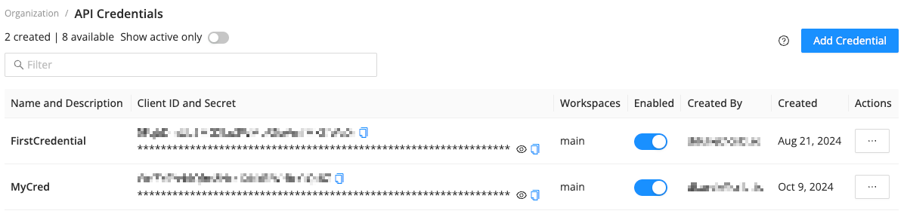
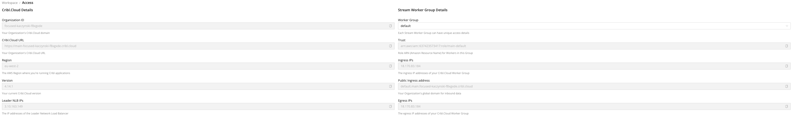

# __Description__

  Connector for Cribl

# __Overview__

  Cribl is built for IT and Security data and provides a unified data management platform for exploring, collecting, processing, and accessing that data at scale.

  This connector imports Cribl Worker data into the Rapid7 Platform.

# __Documentation__

  ## __Setup__

  ### Create an API Credential

  1. Log in to Cribl.Cloud as an Owner or an Admin.

  2. On the top bar, select Products, and then select Cribl.

  3. In the sidebar, select Organization, and then select API Credentials.

  4. Select Add Credential.

  5. Enter a Name and an optional Description.

  6. In the Organization Permissions drop-down menu, select a Role to use for defining Permissions for the Credential’s tokens. 
     The Organization Permissions selector is available on certain plan/license tiers. Without a proper license, all tokens are granted the Admin Role.

     > If you choose the User Role, under Workspace Access, define the desired Permissions for specific Workspaces. Choosing the Admin or Owner Role automatically grants admin access to all Workspaces.

  7. Select Save.
  

  ### Retrieve your Cribl.Cloud URL

  1. Log in to Cribl.Cloud as an Owner or an Admin

  2. In the sidebar, select Access

  3. Copy the Cribl.Cloud URL (this is should be in the following format: `https://<workspaceName>-<organizationId>.cribl.cloud`)
  
