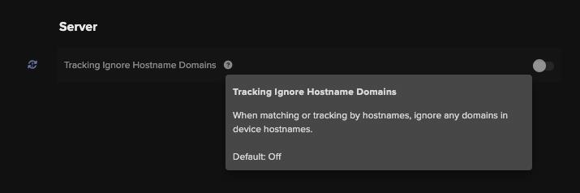

# __Description__

  Connector for Darktrace Platform
  
# __Overview__

  The Darktrace ActiveAI Security Platform defends against unknown threats using AI that learns from your business in real-time.

  This connector synchronizes Darktrace device and subnet details with the Rapid7 Platform.

# __Documentation__

  Configuring the Darktrace Connector involves setting up of the API base URL and generating the necessary Public and Private tokens.
  [API Token Generation Documentation](https://customerportal.darktrace.com/product-guides/main/api-tokens)

  Additionally, turn `ON` the Darktrace setting `Tracking Ignore Hostname Domains` which is recommended to improve data correlation.
