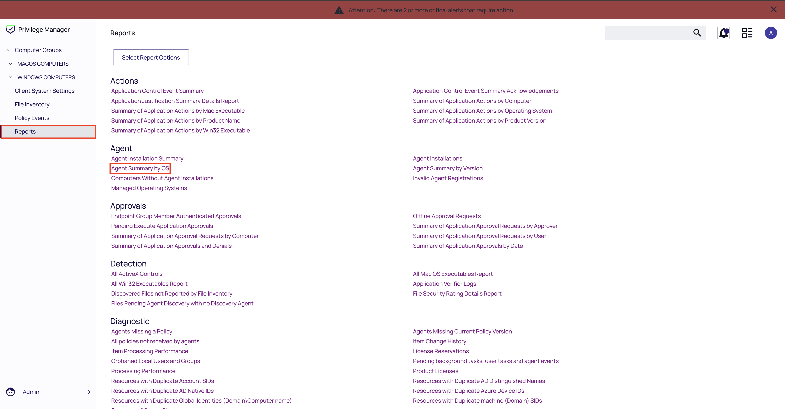
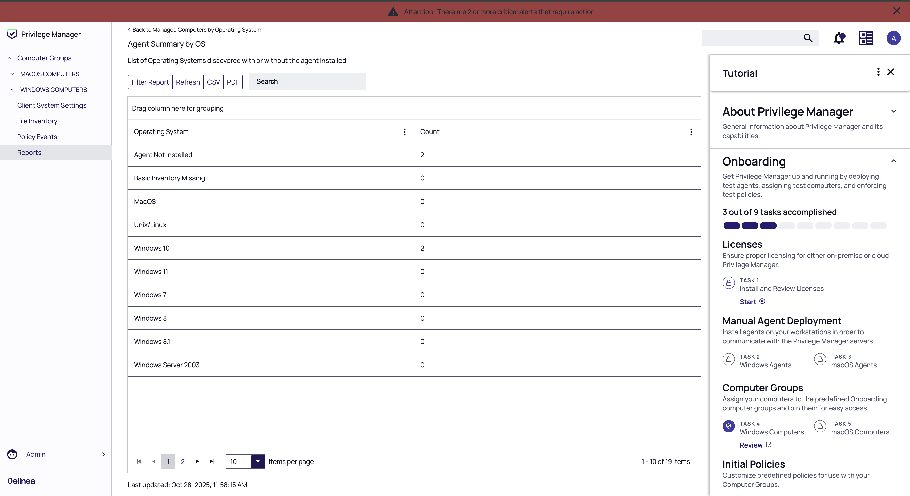
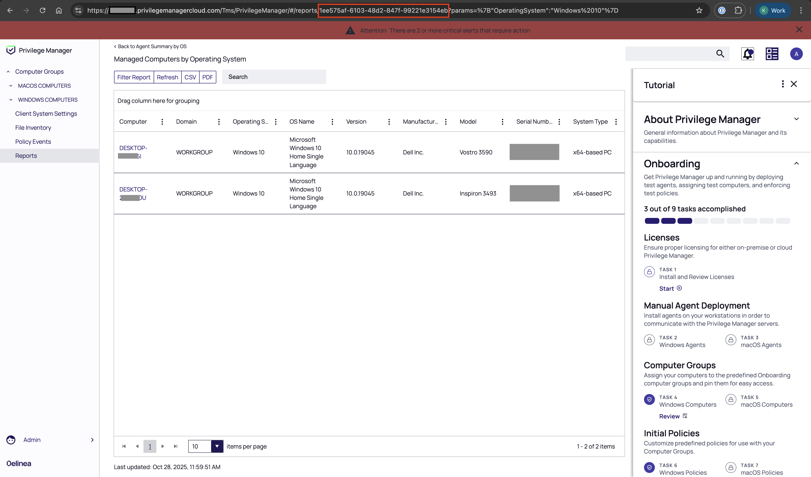

# __Description__

  Connector for Delinea Privilege Manager

# __Overview__

  Delinea Privilege Manager is an endpoint least privilege and application control solution for Windows and macOS. Using
  Privilege Manager discovery, administrators can automatically discover local administrator privileges and enforce the
  principle of least privilege through policy-driven actions.

  This connector synchronizes agent details from Delinea into the Rapid7 Platform.

# __Documentation__

  The connector requires `Base URL`, `Client ID`, `Client Secret` and `Report ID` for fetching the agent details.

  ### To get the Report ID:

  1. Login to the Delinea Privilege Manager UI.
  2. Click on `Reports -> Agent Summary by OS`
     
  3. Choose anyone from the **list of Operating Systems discovered with or without the agent installed**.
     
  4. From the url extract the Report ID
     

  ### To generate `Client ID` and `Client Secret`:

  * Refer to the Delinea Privilege
  Manager [documentation](https://docs.delinea.com/online-help/privilege-manager/admin/users/index.htm#HowtoManuallyAddAPIClientUsers)