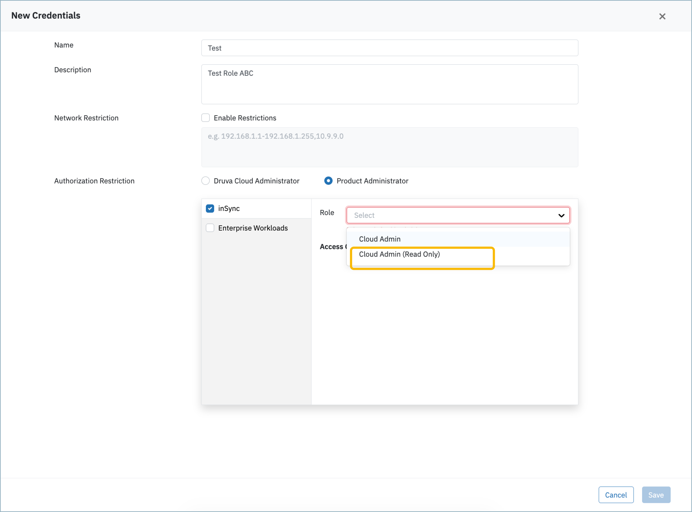

# __Description__

   A connector for the Druva Data Security Cloud platform

# __Overview__

  Druva Data Security Cloud is a comprehensive cloud-native platform that provides cyber resilience, data protection, and endpoint management capabilities for enterprises. The platform delivers automated backup and recovery, threat detection, and data security across endpoints, cloud workloads, SaaS applications, and data centers.

  This connector synchronizes user and device information from Druva into the Rapid7 Platform.

# __Documentation__
   This connector requires `API Base URL`,`Client ID` and `Client Secret` settings to connect to the Druva API.

  To find your `API Base URL` refer to the  [Druva Base URL documentation](https://developer.druva.com/docs/request-and-response-structure#base-url).

  To generate `Client ID` and `Client Secret`:

  1. Log in to the **Druva Cloud Platform Console** and navigate to **Global Navigation > Integration Center > API Credentials**.
  2. Click **New Credentials** and provide a name (e.g., "Rapid7 Surface Command").
  3. Under **Authorization Restriction**, select **Product Administrator**.
  4. Check **inSync** and from the **Role** dropdown, select **Cloud Admin (Read Only)**. This restricts access to data retrieval only, following the principle of least privilege.

  

  5. Click **Save** and copy the generated `Client ID` and `Secret Key`.

  For more details, see the [Druva API Credentials documentation](https://help.druva.com/en/articles/8580838-create-and-manage-api-credentials).

  > **Note:** Do not use the default **Druva Cloud Administrator** role, as it grants full administrative privileges. The **Cloud Admin (Read Only)** role provides sufficient access for this connector, which only reads user and device data.