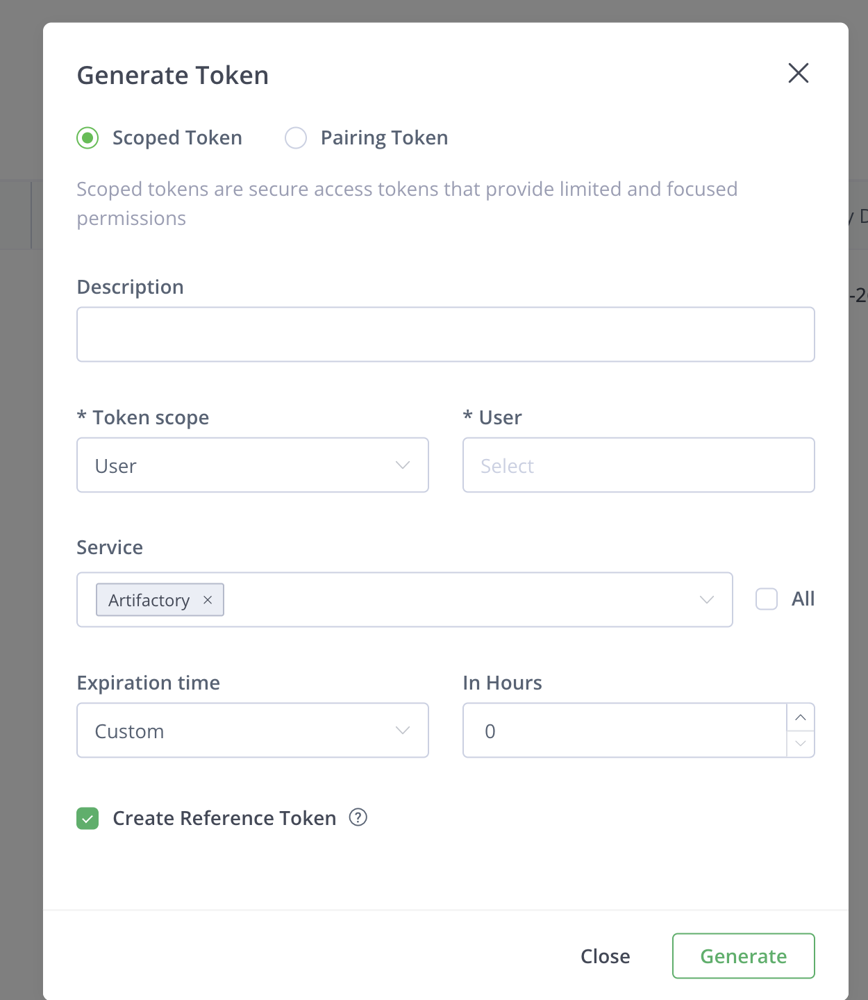

# __Description__

  Connector for importing users, groups, projects, and repositories from JFrog Artifactory

# __Overview__

  JFrog Artifactory is a universal artifact repository manager that stores, manages, and distributes software packages and binaries across the development pipeline. This connector synchronizes user, group, project, and repository data from JFrog Artifactory into the Rapid7 Platform.

# __Documentation__

  ## __Setup__

  The connector requires a `Base URL` and a `Reference Token` with admin-level permissions to access the JFrog Platform APIs. A user with the **Platform Administrator** role can access all the required data.

  ### To get the Base URL:

  1. Log in to your JFrog Platform instance.
  2. The Base URL is the root URL of your JFrog instance, for example: `https://example.jfrog.io/`.

  ### To generate a Reference Token:

  The connector authenticates using a JFrog Access Reference Token. A user with the **Platform Administrator** role is required to access all user, group, project, and repository data via the JFrog REST APIs.

  1. Log in to your JFrog Platform instance as an **admin** user.
  2. Navigate to **Administration** > **User Management** > **Access Tokens**.
  3. Click **+ Generate Token**.
  4. In the **Token Scope** field, select **Admin**.

     > Only a user with the **Platform Administrator** role can retrieve all users, groups, projects, and repositories. Non-admin scoped tokens will not have sufficient permissions for this connector.

  5. In the **User name** field, enter the admin user name for the token.
  6. In the **Service** field, select **Artifactory** (clear the **All** checkbox first if needed).
  7. Set the **Expiration time** as appropriate for your organization's security policy.
  8. Check the **Create Reference Token** checkbox to generate a shortened reference token.
  9. Click **Generate**.
  10. Copy the **Reference Token** value and save it securely — it cannot be retrieved after closing this dialog.

  

  ### Verify TLS

  For on-premises JFrog deployments only.
  By default, the connector verifies the TLS certificate of your JFrog instance. If you are using a self-signed certificate or connecting through a proxy, you can disable this by setting **Verify TLS?** to `false`.
