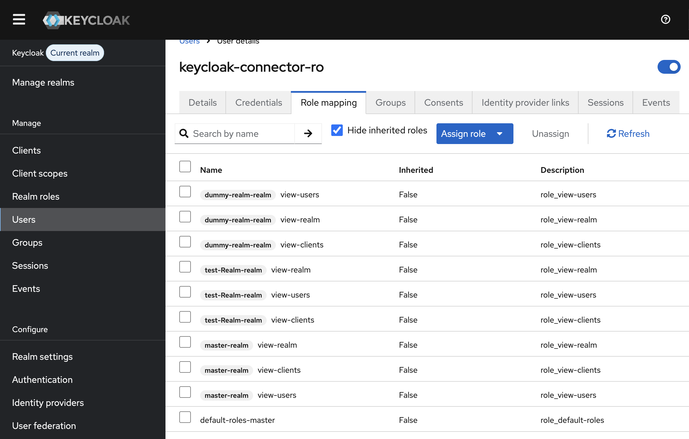

# __Description__
  Connector for Keycloak.

# __Overview__

  Keycloak is an open source software product to allow single sign-on with Identity and Access Management aimed at modern applications and services. 
  
  This connector ingest the Realms, Users, Groups, and Clients information to the Rapid7 Platform.

# __Documentation__

  To configure the Keycloak Connector you must provide `API base URL`, and credentials (username and password) for a user with appropriate roles.

  There are 2 ways to create the required credentials.

  ## Option 1: Create a Master Realm Admin User.
  These credentials must belong to a user in the master realm, because only the master realm can issue admin tokens with permissions that apply across all realms.

  1. Login to the **Keycloak Admin console**.
  2. In left menu, open **Manage Realms** and select `Master`.
  3. Go to **Users** -> **Add user** and create a new user.
  4. After creating the user go to its **Role Mappings**
  5. **Assign Role** -> **Realm Roles** add `role_admin`.
  6. Set a secure password for this user under **Credentials**
  7. Save the credentials in a secure location.
  
  ## Option 2: Create a Master Realm User with read roles.
  This option is recommended since connector requires only read access and if you have to hide ceratin realms from this connector
  1. Login to the **Keycloak Admin console**.
  2. In left menu, open **Manage Realms** and select `Master`.
  3. Go to **Users** -> **add user** and create a new user.
  4. After creating the user go to its **Role Mappings**
  5. **Assign Role** -> **Client Roles** and assign 
     -`view-users`
     -`view-client`
     -`view-realm`
    Assign these roles to the respective realms that the connector needs access to.
    
  6. Set a secure password for this user under **Credentials**
  7. Save the credentials in a secure location.    
