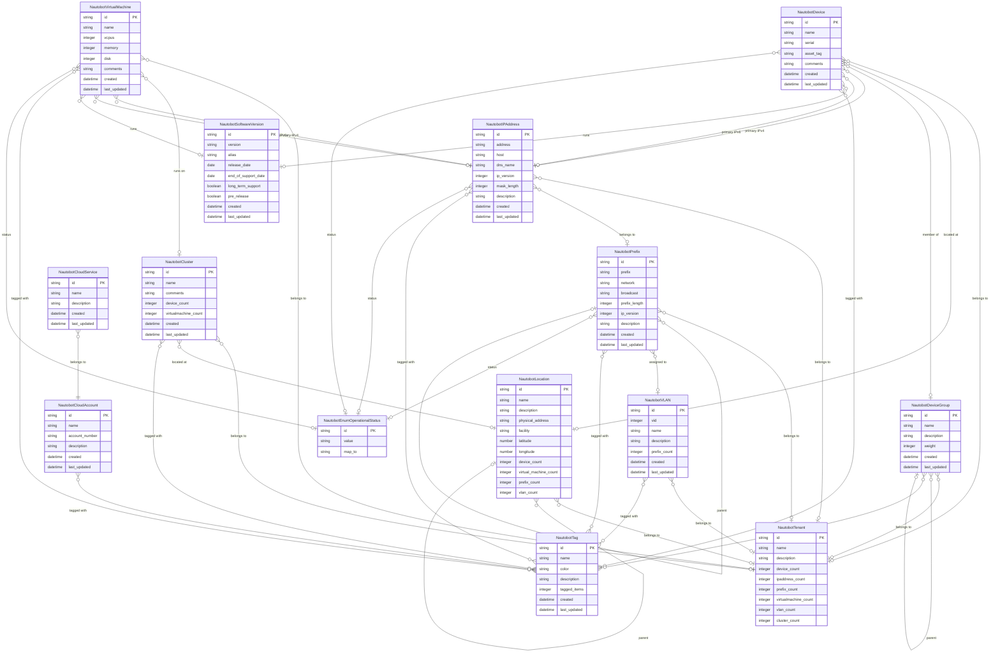

# Nautobot Connector Data Model

This document describes the entity-relationship model for the Nautobot connector types.

## Entity-Relationship Diagram

## Type Descriptions

| Type | Description | Extends |
|------|-------------|---------|
| **NautobotTenant** | Organizational tenant representing customers, business units, or departments | Organization |
| **NautobotLocation** | Physical or logical location (sites, buildings, data centers) with hierarchical support | Location |
| **NautobotCluster** | Virtualization or compute cluster (VMware, Hyper-V, etc.) | System |
| **NautobotDevice** | Physical network device (servers, switches, routers, infrastructure hardware) | Machine |
| **NautobotVirtualMachine** | Virtual machine running on a cluster | Machine |
| **NautobotDeviceGroup** | Controller-managed device group | core.component-group |
| **NautobotIPAddress** | IP address assignment (IPv4/IPv6) with DNS names and interface assignments | IpAddress |
| **NautobotPrefix** | Network prefix (subnet) in CIDR notation | Network |
| **NautobotVLAN** | Virtual LAN configuration for network segmentation | Network |
| **NautobotSoftwareVersion** | Software/firmware version definition for network devices | Software |
| **NautobotCloudAccount** | Cloud provider account (AWS, Azure, GCP) | CloudAccount |
| **NautobotCloudService** | Cloud service resource (RDS, S3, Lambda, etc.) | core.named-object |
| **NautobotTag** | Tag for categorizing and organizing resources | SourceTag |
| **NautobotEnumOperationalStatus** | Operational status enumeration values | EnumOperationalStatus |

## Key Relationships

### Ownership & Organization
- **Tenant** owns Devices, VMs, Clusters, Locations, IP Addresses, Prefixes, VLANs, and Device Groups

### Location Hierarchy
- **Locations** can have parent-child relationships (e.g., Building → Floor → Room)
- **Devices** and **Clusters** are assigned to Locations

### Compute Infrastructure
- **Virtual Machines** run on **Clusters**
- **Devices** can be members of **Device Groups**
- **Device Groups** support hierarchical parent relationships

### Network Infrastructure
- **IP Addresses** belong to **Prefixes** (subnets)
- **Prefixes** can have parent-child relationships for subnet hierarchies
- **Prefixes** can be assigned to **VLANs**
- **Devices** and **VMs** have primary IPv4 and IPv6 addresses

### Software
- **Devices** and **Virtual Machines** can reference a **Software Version**

### Cloud Resources
- **Cloud Services** belong to **Cloud Accounts**

### Tagging
- Most types support tagging via **NautobotTag** for organization and filtering
