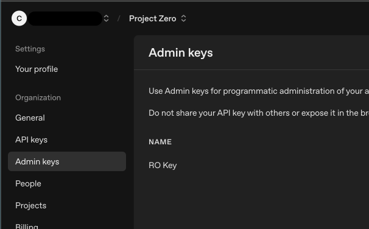
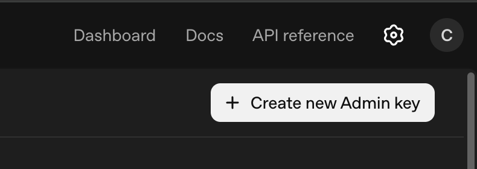
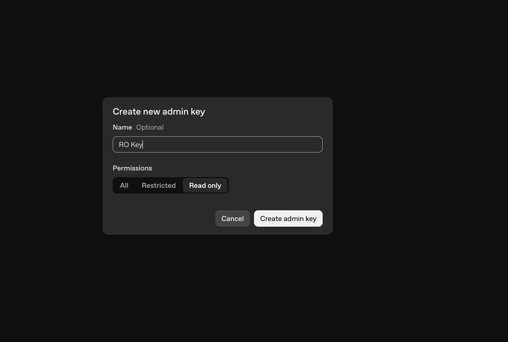

# __Description__

Connector for OpenAI

# __Overview__

OpenAI provides advanced AI models and services including ChatGPT. This connector synchronizes organization users from OpenAI into the Rapid7 Platform, enabling security administrators to track user access to Generative and LLM AI Models.

# __Documentation__

  ## __Setup__

  1. Log in to the OpenAI Platform [https://platform.openai.com/](https://platform.openai.com/)

  2. Navigate to **Settings** → **Organization** → **Admin Keys**

  

  3. Click **Create new Admin key**

  

  4. Select **Read Only** as the permission level

  

  5. Provide a descriptive name (e.g., "Rapid7 Surface Command Connector")

  6. Click **Create admin key**

  7. **Important**: Copy the API key immediately - it will only be shown once

  8. Store the key securely for entry into Rapid7 Surface Command

   > **NOTE:** The Admin API Key will have the format: `sk-admin-xxxxxxxxxxxxxxxxxxxxxxxxxxxxx`
