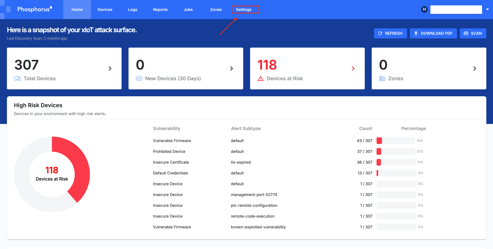
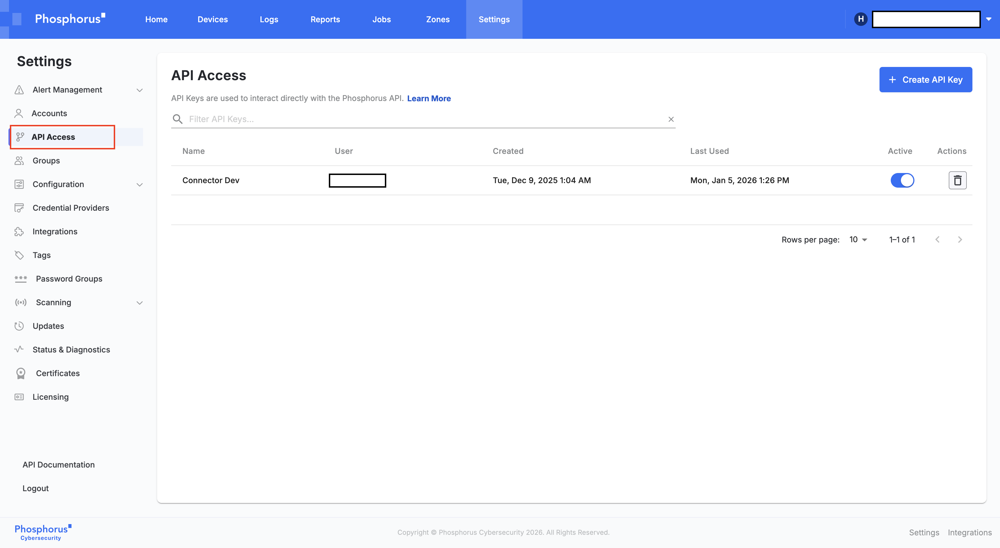

# __Description__

  Connector for Phosphorus

# __Overview__

  Phosphorus provides a unified security platform for xIoT (Extended Internet of Things), encompassing IoT and Operational Technology (OT) devices. Its primary function is to discover, assess, harden, and monitor these specialized assets, which are often missed by traditional IT security tools.

  This connector will import xIoT/OT asset data and their associated vulnerabilities from the Phosphorus platform. This provides crucial visibility into the security posture of specialized devices, such as the traffic controllers, CCTV, and other OT systems mentioned in the requirement, mapping their risks directly into the Surface Command data model.

# __Documentation__

  This connector requires Base URL and API Key from the Phosphorus Platform.
  - **Base URL**: The Base URL for accessing the API Endpoints.
  - **API Key**: The API Key for accessing the API Endpoints obtained from the Phosphorus Platform.

  ### To get the API Key:

  1. Log in to your Phosphorus console
  2. Go to the `Settings` tab
     
  3. Select the `API Access`
     
  4. Within the API Settings, you have `Create API key` option. Click on it
  5. Provide a `API Key Name` for the `API key` and `User` to assign the API Key to create the API Key
