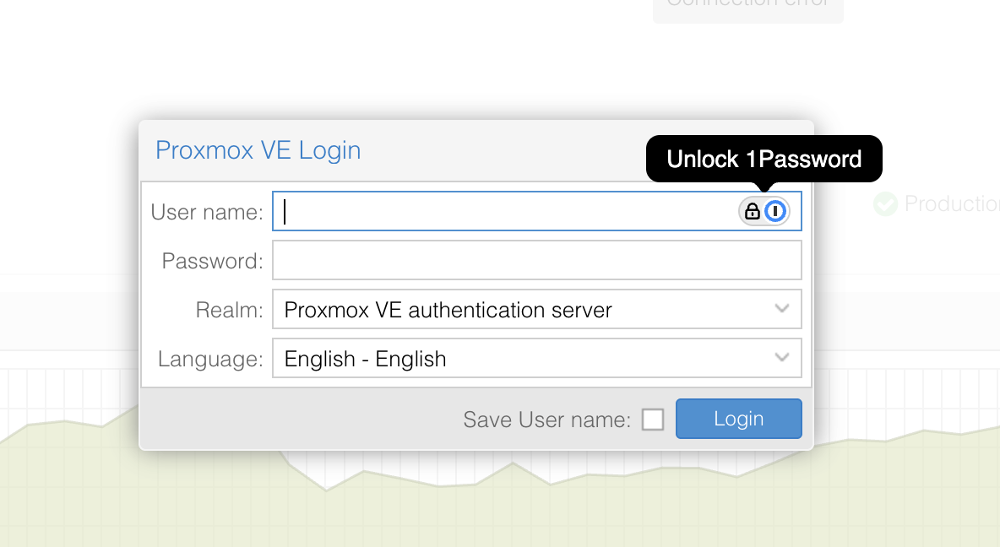
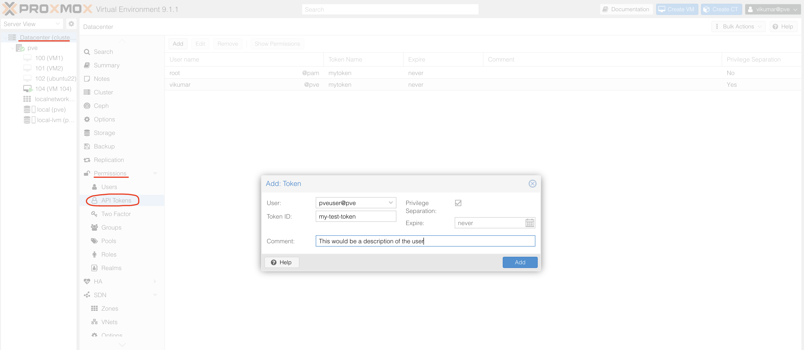
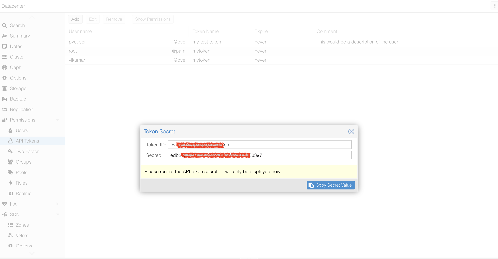

# __Description__

  Connector for Proxmox Virtual Environment (PVE)

# __Overview__

  Proxmox Virtual Environment (PVE) is a complete open-source platform for enterprise virtualization. With the built-in web interface you can easily manage VMs and containers, software-defined storage and networking, high-availability clustering, and multiple out-of-the-box tools using a single solution.

  This connector synchronizes critical infrastructure data including virtual machines, storage systems, cluster nodes, users, and groups from your Proxmox environment into the Rapid7 Platform.

# __Documentation__

  This connector requires `Base URL`, `User`, `Realm`, `Token ID` and `Token Secret` for API key creation to access APIs in the form of `PVEAPIToken=USER@REALM!TOKENID=UUID` when making API requests. Refer to the API client documentation [here](https://pve.proxmox.com/wiki/Proxmox_VE_API#Authentication).

  ## Prerequisites

    Before configuring this connector, ensure you have:

    1. Proxmox PVE server running and accessible
    2. API token with appropriate permissions (see Authentication section below)
    3. Network access from the Rapid7 platform to your Proxmox PVE server.

  ## Creating API Tokens

  1. Log into Proxmox Web Interface with administrator credentials 
    - https://your-proxmox-server:8006

      

  2. Navigate to API Tokens
    - Go to: Datacenter → Permissions → API Tokens
    - Click Add to create new token
      
      

  3. Configure Token
    - User: Select or create a user (e.g., `root@pam` or create a dedicated service user)
    - Realm: The realm type determines which authentication backend is used for a user, as shown below:
        pam - Linux PAM (system users)
        pve - Proxmox VE Authentication Server
    - Token ID: Enter a descriptive name (e.g., `rapid7-connector`)
    - Privilege Separation: Uncheck this option to inherit user permissions. Permissions can be assigned to a user or group of users.
    - Expire: Set an appropriate expiration date or leave empty for no expiration

  4. Record Credentials
    - Save the Token ID and Token Secret
    - Token secret is only shown once and cannot be retrieved later

      