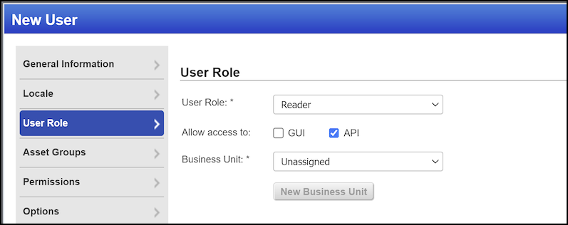

# __Description__

  Connector for Qualys Cloud Platform VMDR

# __Overview__

  This connector collects asset and vulnerability information from Qualys Cloud Platform VMDR.

  On each run, the connector cleans up stale templates and reports (from previous versions of this connector),
  then lists hosts using either Asset Tags (if configured) or Asset Groups. It then fetches host detections filtered
  by severity and vulnerability state, and finally downloads vulnerability details from the
  Qualys Knowledge Base for each unique QID found.

# __Documentation__

  ## __Setup__

  This connector requires a Server URL, Username, and Password to authenticate
  with the Qualys Cloud Platform API.

  ### Server URL

  The Server URL is the base URL of your Qualys cloud platform subscription.
  For example: `https://qualysguard.qualys.eu`.

  To determine your platform URL, refer to the
  [Qualys Platform Identification documentation](https://www.qualys.com/platform-identification/).

  ### Username and Password

  Qualys API access requires a user account with at least the **Reader** role
  and **API Access** granted, plus access to the assets whose scan data is
  desired. Alternatively, the API user should be a **Manager**.

  Authentication uses the user's login ID and password.

  

  > **NOTE:**
  > If using a user ID that was newly created, the customer must ensure that
  > the new user ID has gone through the EULA acceptance process.

  ### Minimum Qualys Severity

  Controls which vulnerability findings are imported. Only detections with a
  severity at or above this threshold are included. Qualys Severity ranges
  from 1 to 5, with 5 being the most severe. Defaults to `4`.

  ### Asset Tags

  An optional comma-separated list of asset tag names to scope the import.
  For example: `tagA,tagB`.

  If set, the connector uses these tags to list hosts instead of using Asset Groups.
  This takes priority over the Asset Groups setting.

  ### Asset Groups

  An optional comma-separated list of Asset Group names or IDs to include in
  the import. For example: `group1,group2`.

  If left empty (and Asset Tags is also empty), the connector will use all
  Asset Groups accessible to the configured user. The groups the connector
  can access are controlled by your Qualys administrator.

  > **NOTE:** If Asset Tags are set, this setting is ignored.

  ### Asset Group Batch Size

  The maximum number of Asset Groups to include in a batch when
  gathering Hosts. If you notice performance issues, consider
  reducing this value. Defaults to `10`.

  ### Vulnerability States

  Controls which vulnerability states are imported from Qualys. Select one or
  more of: `NEW`, `ACTIVE`, `REOPENED`, `FIXED`. Defaults to
  `NEW`, `ACTIVE`, `REOPENED`.

  ### Delete Old Reports (Deprecated)

  This setting is deprecated and no longer has any effect. The connector now
  cleans up stale templates and reports automatically at the start of each
  import run.

  ### Cancel Running Reports (Deprecated)

  This setting is deprecated and no longer has any effect. Running reports
  are automatically cancelled during the cleanup step.

  ### Use Default Template (Deprecated)

  This setting is deprecated and no longer has any effect. The connector no
  longer uses report templates for data collection.
