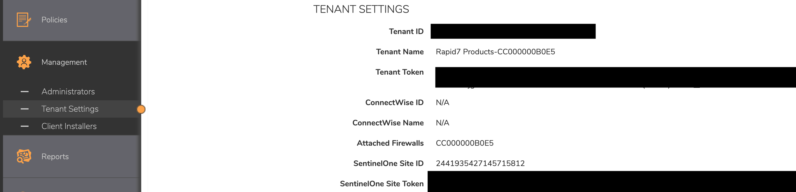

# __Description__

  Connector for SonicWall Capture Client

# __Overview__

  SonicWall Capture Client is a cloud-managed service for endpoint security and device management.

  This connector imports endpoint devices, SentinelOne agents, users, groups, risky applications, and installed software from SonicWall Capture Client into the Rapid7 Platform.

# __Documentation__

  ## __Setup__

  The connector requires a **MySonicWall API Key**, **Capture Client Region**, and **Tenant ID** to authenticate with the SonicWall Capture Client API.

  ### 1. MySonicWall API Key

  Generate an API key from your MySonicWall account:

  > For detailed instructions, refer to the SonicWall documentation:
  > [How to Generate MSW API Key](https://www.sonicwall.com/support/technical-documentation/docs/msw-api_guide/Content/API_Overview/how-to-generate-api-token.htm)

  > **NOTE**: When creating the API Key, an **authentication rule must be included**. Ensure that the IP ranges for your Surface Command Region are inserted, with one IP range per line. This information can be found in our [documentation](https://docs.rapid7.com/surface-command/allowlist-surface-command-ips/)

  #### Required Permissions

  When creating the API token for a user-group, ensure the following scopes are assigned:

  | Scope | Permission | Description |
  |-------|-----------|-------------|
  | **CC / EndPoint** | Viewer | Read-only access to Capture Client endpoints and devices |
  | **Tenants** | Read Only | Read-only access to tenant configurations and settings |

  ### 2. Capture Client Region

  Select the region where your Capture Client instance is deployed:

  | Region | API Base URL |
  |--------|-------------|
  | **US** (default) | `captureclient-36.sonicwall.com` |
  | **EU** | `captureclient-36eu.sonicwall.com` |

  ### 3. Tenant ID

  Locate the Tenant ID from the SonicWall Capture Client management console:

  1. Log in to the [SonicWall Capture Client](https://captureclient-36.sonicwall.com) management console.
  2. Navigate to **Management** > **Tenant Settings** in the left navigation panel.
  3. Copy the **Tenant ID** value displayed at the top of the Tenant Settings page.

  

  ### Important Notes

  - The MySonicWall API key must have read access to Capture Client data.
  - SentinelOne integration must be enabled in the Capture Client tenant for agent and risky application data.