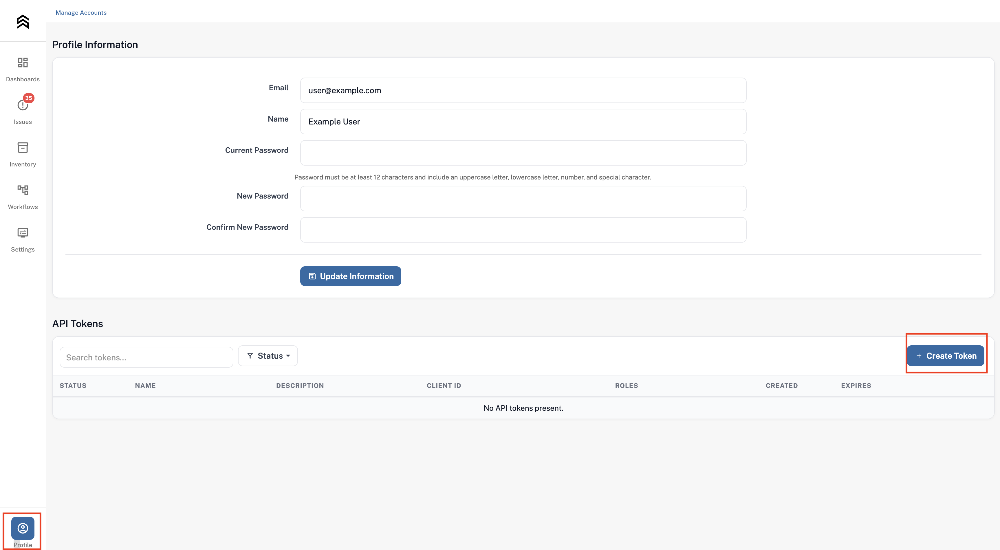
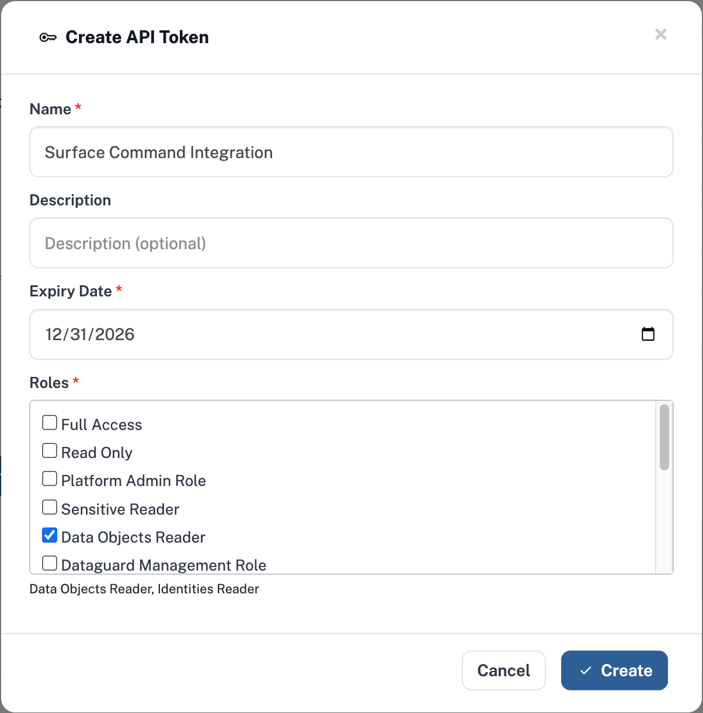

# __Description__

  Connector for Symmetry DataGuard

# __Overview__

  Symmetry Systems DataGuard is a data security posture management (DSPM) solution that provides visibility into data stores, identities, and permissions across hybrid cloud environments to secure sensitive data.

  This connector imports DataGuard-classified data stores, objects, and classification metadata into Surface Command for analysis.

# __Documentation__
  This connector requires `Base URL`, `Client ID` and `Client Secret` to connect to the Symmetry DataGuard API.

  ### __Obtain the Base URL__
  - The `Base URL` is the URL of your Symmetry DataGuard instance (e.g., `https://example.symmetry-systems.com`).
  - This is typically the same URL you use to log in to the Symmetry DataGuard console, without any path or query parameters.

  ### __Generate a Client ID and Client Secret__
  To generate API credentials, follow these steps:
  - Log in to the Symmetry DataGuard console.
  - Navigate to the `Profile` page (typically accessible via your user menu in the lower-left corner).
  - Scroll to the bottom of the page to find the `API Tokens` section.
  - Click the `+ Create Token` button on the right.

      
  
  - Fill in the following fields:
    - **Name**: A descriptive name for this API token (e.g., "Surface Command Integration")
    - **Description**: Optional details about how this token will be used
    - **Expiry Date**: Set an appropriate expiration date for the token
  - Select the following **Roles** (required for this connector):
    - **`Data Objects Reader`** — Grants permission to read classified data object information
    - **`Identities Reader`** — Grants permission to read identity and access information
  - Click `Create` to generate the token.

      
  
  - Copy the `Client ID` and `Client Secret` displayed on the confirmation screen. **Note**: The `Client Secret` will only be displayed once, so store it securely (e.g., in a password manager or secrets vault).

  ### __Optional Settings__
  - **Include Classified Object Details?** (`import_classified_object`): Controls whether the connector imports individual classified data objects (files, database records, etc.) in addition to data store-level classifications.
    - **Enabled**: Imports classified data stores, individual classified objects, and their associated classification metadata into Surface Command. This provides granular visibility but may significantly increase import time and data volume.
    - **Disabled (default)**: Imports only classified data stores and classification metadata; individual classified objects are not imported. Recommended for initial setup or environments with large datasets.