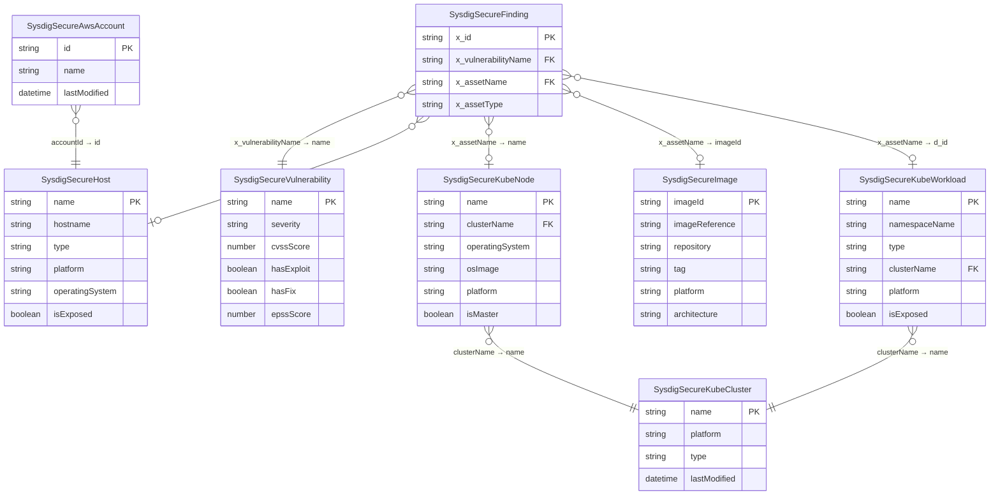

# Sysdig Secure Connector — Type Relationships

## Inheritance

| Type | Extends |
|------|---------|
| SysdigSecureAwsAccount | CloudAccount |
| SysdigSecureKubeCluster | System |
| SysdigSecureKubeWorkload | System |
| SysdigSecureKubeNode | Machine |
| SysdigSecureHost | Machine |
| SysdigSecureImage | Template, core.cloud-component, core.managed.asset |
| SysdigSecureVulnerability | Exposure |
| SysdigSecureFinding | Finding |
