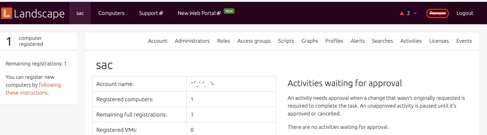
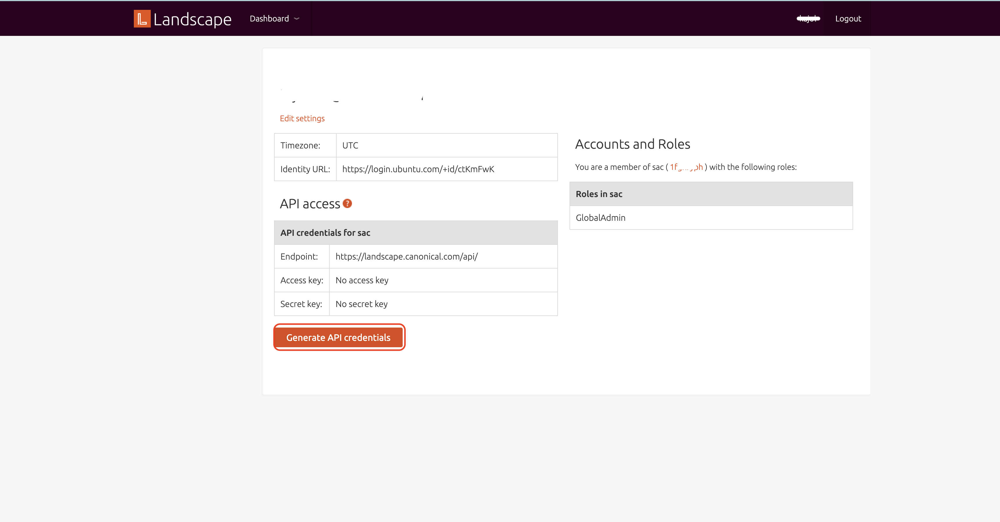

# __Description__

  Connector for Ubuntu Landscape endpoint management platform.

# __Overview__

  Ubuntu Landscape is a central management and monitoring platform for Ubuntu systems. It allows administrators to manage large fleets of Ubuntu instances by automating updates, monitoring performance metrics, and auditing security compliance across physical, virtual, and cloud-based assets.

  This connector imports computers (with hardware and network details), installed packages, computer groups, and tags from Ubuntu Landscape.

# __Documentation__

  This connector requires `Landscape URL`, `Access Key`, and `Secret Key` configuration parameters to connect to the Ubuntu Landscape API.

  To obtain the `Access Key` and `Secret Key`, follow these steps:
  1. Log in to your Ubuntu Landscape account.
  2. Navigate to the "User Settings" or "Profile" section.
    
  3. Look for an option to **Generate API Credentials**.
    
  4. Generate API credentials, which will provide you with an `Access Key` and a `Secret Key`. Make sure to copy and securely store these keys. Your `Landscape URL` is the base URL of your Landscape server without a trailing slash (e.g., `https://landscape.example.com`).
  5. Ensure that the API credentials are associated with a user account that has, at minimum, read-only permissions to computers, computer groups, tags, and installed package inventory in Ubuntu Landscape. Write permissions are not required for this connector and using higher-privileged credentials is not recommended.

  For more detailed information on creating and managing access keys, refer to Canonical's official Ubuntu Landscape documentation: [Ubuntu Landscape documentation](https://ubuntu.com/landscape/docs).