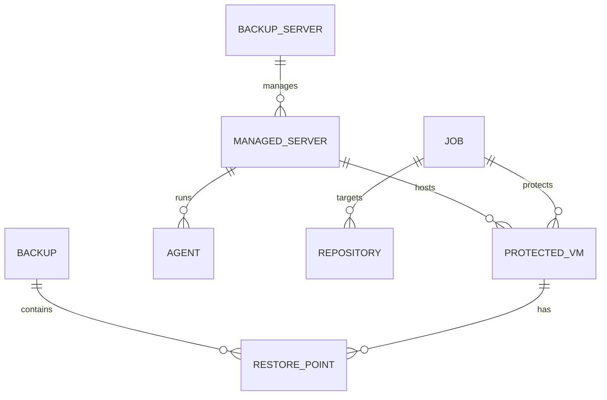

```mermaid
erDiagram
    BACKUP_SERVER ||--o{ MANAGED_SERVER : manages
    MANAGED_SERVER ||--o{ PROTECTED_VM : hosts
    MANAGED_SERVER ||--o{ AGENT : runs
    JOB ||--o{ PROTECTED_VM : protects
    JOB ||--o{ REPOSITORY : targets
    BACKUP ||--o{ RESTORE_POINT : contains
    PROTECTED_VM ||--o{ RESTORE_POINT : has

```