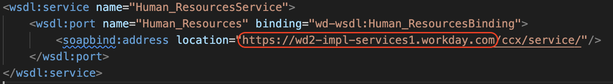

# __Description__

  Connector for Workday

# __Overview__

  Workday unites HR and finance on a single AI platform.

  This connector imports details of your organization and users into Surface Command.

# __Documentation__
  
  For authentication, this connector requires the Web Service URL, Tenant Alias,
  Client ID and Secret, and a Refresh Token.

  Optionally, you can specify the WQL fieldname that is used for Termination Date
  in your Workday environment.  This can be the technical name of any date field that you use
  for tracking termination.  For example, enter `lastDayOfWork` to use the property by that name.
  In the Surface Command schema this data will be populated as `x_termination_date`.

  To find these settings, follow the below steps:

  ## Workday Base URL
  To find the Workday Base URL:
  1. Log into the Workday console.
  2. In the search bar, search for Public Web Services and click on it.
  3. Hover over Human Resources and click the three dots to access the menu.
  4. Navigate to Web Services > View WSDL.
  5. On the bottom of the page, find the location parameter in the soapbind:address tag:
    
  6. Copy the parameter until **/ccx**. e.g `https://example-workday-services1.workday.com`
  7. Copy the Workday Base URL value and provide it in the connector configuration.

  ## Tenant Alias

  * The Tenant Alias is the unique name of your Workday tenant. You can find it in the URL when you log into Workday. For example, if your Workday URL is `https://www.myworkday.com/tenant_name/d/task/25725.htmld`, then your Tenant Alias is `tenant_name`.

  ## Client ID and Client Secret
  
  To create the Client ID and Client Secret:
  1. From the Console section of the Developer Site menu, select API Clients.
  2. Click the Create API Client button.
  3. Enter a unique Client name.
  4. Enter a secure URL for OAuth to redirect your app users during authentication.
  5. Authorized CORS Domains. This enables secure access to selected resources from a server on a different domain than the current site e.g https://www.workday.com:1234.
  6. The below scopes are required:
      - `Adaptive Planning for Financial Plans`
      - `Adaptive Planning for the Workforce`
      - `System`
      - `Organizations and Roles`
  7. These steps are also documented in the [Workday Developer Portal](https://developer.workday.com/documentation/zwx1518028675482-1/CreateYourAPIClient).


  ## Refresh Token
  The Refresh Token is required to authenticate using the Client ID and Client Secret.  Follow the steps below to generate a Refresh Token.
  
  1. Submit an authorization request to the authorize endpoint. Use these query parameters:
      * response_type: `code` (for authorization code grant).
      * client_id: Use the value received at client registration.
      * redirect_uri (Optional): Indicates the URL to return the user to after authorization is complete. Use the value you configured on the client at registration.
      * state: A random string generated by your app, which you'll verify later.

      Example:
      ```
      GET https://auth.api.workday.com/v1/authorize?response_type=code&client_id=ODQ4ZDdkNzItMzhiMC...&redirect_uri=https://example.com&state=xyz
      ```
      After the user signs in and approves access to Workday resources (if required), the authorize endpoint returns the authorization code.
      For this example, the redirect URI was set to https://example.com during client registration:
      ```
      HTTP/1.1 302 Found Location: https://example.com/#code=88xr1xk....0&state=xyz
      ```

  2. Create a POST request to call the token endpoint. A complete token request includes these parameters:
      * grant_type: `authorization_code` (indicates the grant type of this token request).
      * client_id: Use the value received at client registration.
      * redirect_uri (Optional): Use the value you configured on the client at registration.
      * code: The authorization code returned from the authorize endpoint in the previous step.

  3. Get the Client ID and the Client Secret of the API Client from the Console on the Workday Developer Site. These values will enable you to provide the proper headers to call the endpoint.

  4. Encode these values into Base64 format. Use the format `[Client ID]:[Client Secret]`. Do not add a space after the colon.

  5. Build the Authorization header and body.
      * Populate the header of the request with `ID [Encoded Value]`. You must add a space after ID.e.g
    
      ```bash
      Authorization: ID T0RRNFpEZGtOekl0TX.....
      ```
      * Populate the body of the request with the required parameters.e.g.
      ```bash
      grant_type=authorization_code&code=88xr1xk2snm6u6...&client_id=ODQ4ZDdkNzItMz...&redirect_uri=https://example.com
      ```

  6. Use the Authorization header and body that you built to submit the request to the token endpoint. Example:
      ```
      POST https://auth.api.workday.com/v1/token
      ```

      The token endpoint returns the access token and refresh token. Example:
      ```
      {
          "access_token": "7c3obrknwd6nnkxv...",
          "refresh_token": "yxsiqvdkakj0tp9a4i...",
          "token_type": "Bearer"
      }
      ```

  7. Copy the refresh token value and provide it in the connector configuration.

  8. These steps are also documented in the [Workday Developer Portal](https://developer.workday.com/documentation/yai1528997518068/AuthenticateUsingtheAuthorizationCodeGrantType).
