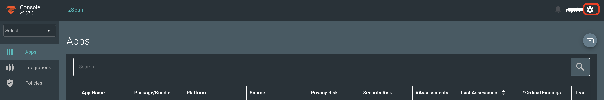
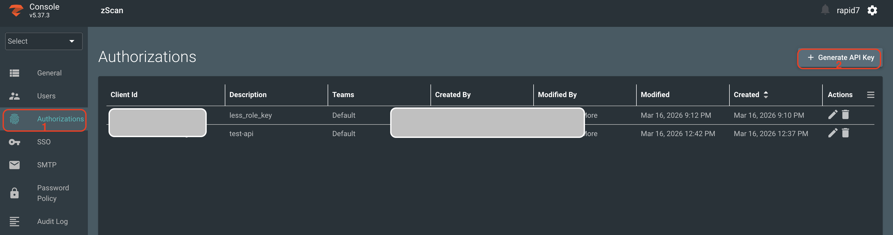
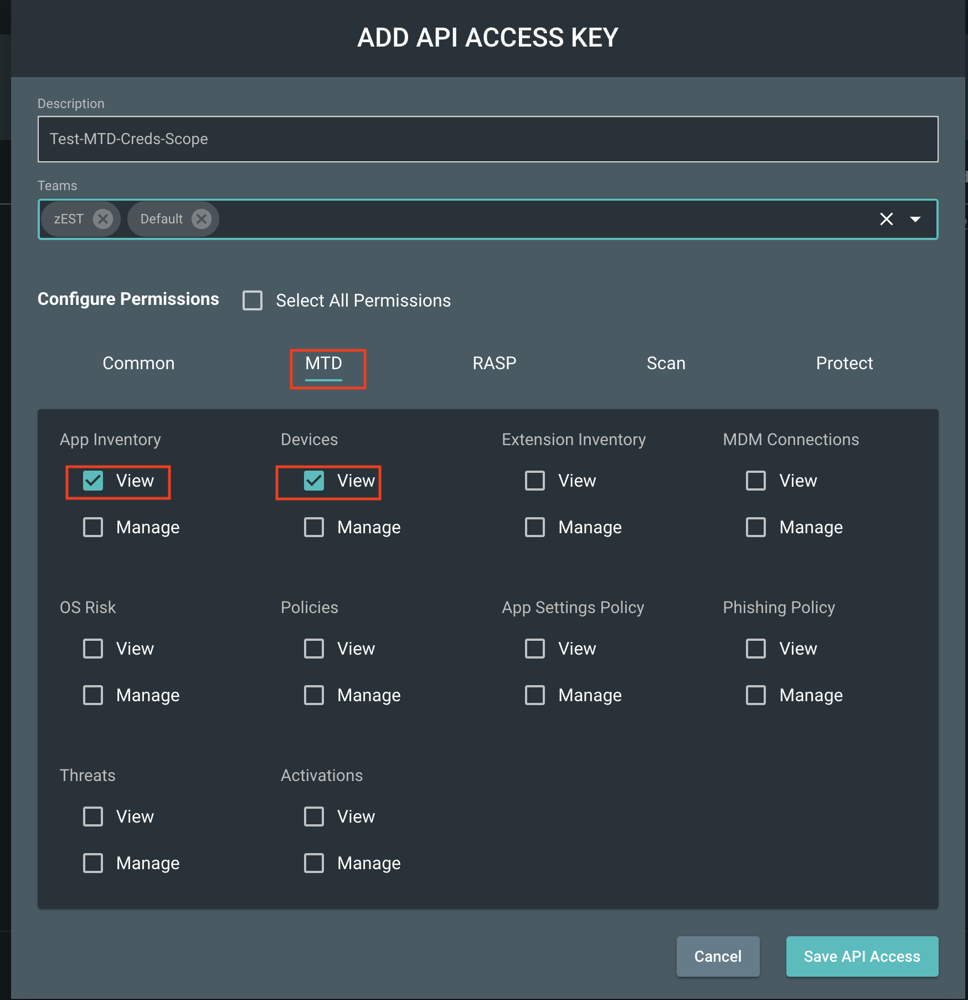

# __Description__

  Connector for Surface Command that imports mobile application and security finding data from Zimperium.

# __Overview__

  Zimperium secures both mobile devices and applications so they can safely and securely access data.

  This connector integrates mobile application inventory, threats and security findings data from the Zimperium API with the Rapid7 Platform, enabling visibility into mobile application security posture.

# __Documentation__

  This connector requires `Base URL`, `Client ID`, and `Client Secret` credentials to connect to the Zimperium API.

  #### Generating API Credentials
  - Log in to your zConsole. You must have administrative access to generate these values and access these options.
  - On the right-hand sidebar, click on the Authorizations tab (located under the 'Users' section).
  
  - Click the **[+ Generate API Key]** button located at the top right of the **Authorizations** table.
  
  - **Description**: Enter a clear name for the key (e.g., API-Surcom-Key).
  - **Teams**: Select the appropriate team from the dropdown menu that this API key will belong to.
  - Under **Configure Permissions**, grant the permissions required for all connector API calls:
    - In the **MTD** section, provide **`App Inventory`** and **`Devices`** View permission so the connector can retrieve device and installed application data.
      
  - Click **Save API Access** to generate the credentials.
  - Copy the **Client ID** and **Client Secret** immediately — the secret is only shown once and cannot be retrieved later. Store these credentials securely (e.g., in a password manager).
  
  For more information, see the [Zimperium documentation](https://zc202.zimperium.com/console-docs/mtd-docs/api/getting_started.html).
